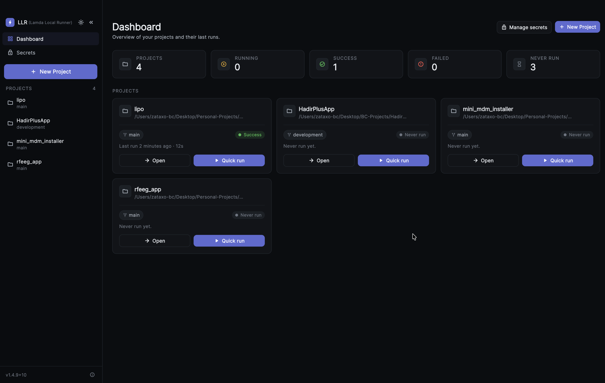
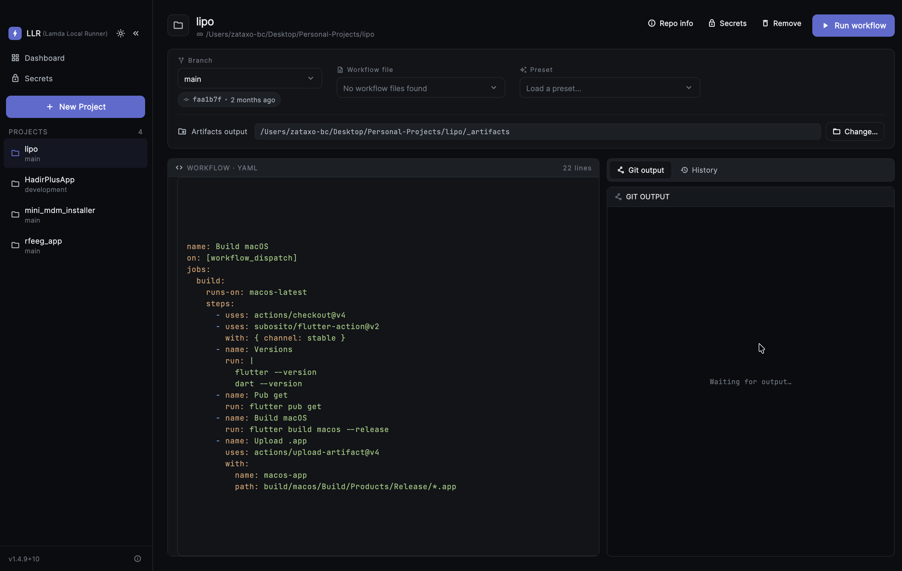
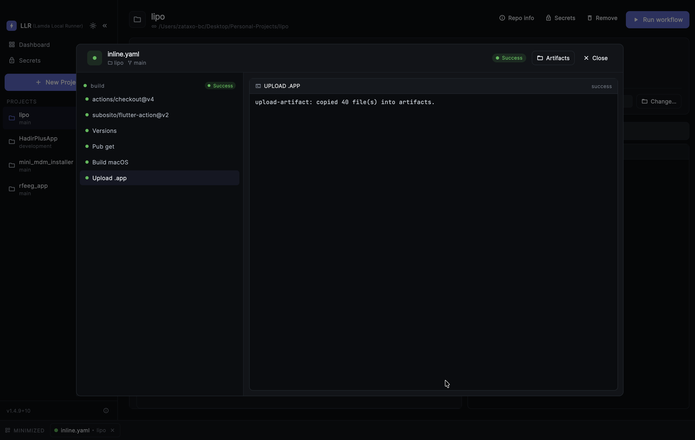
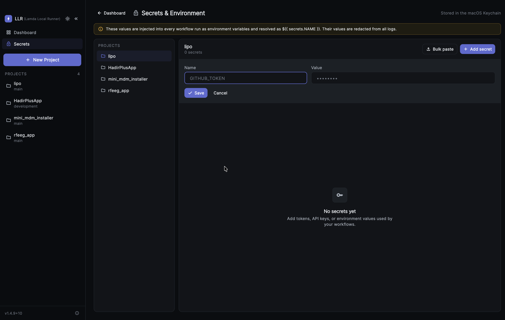

<p align="center">
  
</p>

<h1 align="center">Lamda Local Runner Pipeline</h1>

<p align="center">
<strong>Run your GitHub Actions workflows locally on your Mac — no servers, no minutes, no waiting.</strong>
</p>

<p align="center">
A Flutter macOS desktop app that parses GitHub Actions-style workflow YAML and executes each step in a real shell on your own machine, against any branch of any repo you point it at.
</p>

---

## Why

GitHub Actions is great, but iterating on a pipeline means pushing a commit, waiting in a queue, watching a remote log, and burning CI minutes for every small change. Zataxo Pipeline flips that around: it takes the **same workflow YAML** you already have in `.github/workflows/` and runs it **locally**, step by step, with live logs — so you can test, debug, and build without touching GitHub's servers.

Because it runs on real macOS hardware (not a Linux container), it can build **Apple targets** — iOS and macOS Flutter apps — which containerized local runners simply can't.

## Key features

- **Two ways to add a project**
  - **Clone a remote repo** — paste any Git URL (GitHub, GitLab, Bitbucket, self-hosted) and the app clones it locally.
  - **Import a local repo** — already have the repo on disk? Point the app at an existing folder with a `.git` directory and it uses it in place.
- **Work from any branch** — the app reads all branches and lets you check out and pull any one of them before a run.
- **Use your existing workflows or write your own** — it auto-discovers every file under `.github/workflows/`, or you can paste/edit YAML directly in the built-in editor.
- **Live, step-by-step execution** — jobs and steps run in order with real-time streaming stdout/stderr and per-step status indicators.
- **Real artifacts** — `upload-artifact` steps copy your build outputs into a local `_artifacts/` folder you can open in Finder.
- **Local & offline** — everything happens on your machine. No tokens for execution, no CI minutes, no queue.

## How it works

```
  ┌─────────────┐     ┌──────────────┐     ┌─────────────┐     ┌──────────────┐
  │  Add repo   │ ──▶ │ Pick branch  │ ──▶ │ Pick / write│ ──▶ │  Run & watch │
  │ clone/import│     │  checkout    │     │  workflow   │     │  live logs   │
  └─────────────┘     └──────────────┘     └─────────────┘     └──────────────┘
```

1. **Add a project.** Clone a remote repo by URL, or import an existing local `.git` repository. Cloned repos land in `~/Library/Application Support/zataxo_pipeline/projects/<repo>/`.
2. **Pick a branch.** The app lists every branch; selecting one runs a checkout and pull so your build reflects that branch's code.
3. **Choose a workflow.** Select any file the app finds under `.github/workflows/`, or paste your own YAML into the editor and tweak it freely.
4. **Run.** The workflow is parsed and executed job-by-job, step-by-step. Each step streams its output live, and you get a clear pass/fail status as it goes.
5. **Collect artifacts.** Anything an `upload-artifact` step matches is copied into `<project>/_artifacts/`, one click away in Finder.

## Screenshots

### Dashboard

The main dashboard gives you an at-a-glance view of all your projects, active runs, and recent history.



### Workflow Settings

Configure workflow files — auto-discover `.github/workflows/` YAML files or paste/edit your own directly in the built-in editor.



### Live Workflow Execution

Watch your workflow run step by step with real-time streaming stdout/stderr, per-step pass/fail indicators, and a collapsible log panel.



### Secrets Management

Store encrypted secrets locally on your machine — environment variables are injected into workflow steps just like GitHub's `secrets.*` context.


